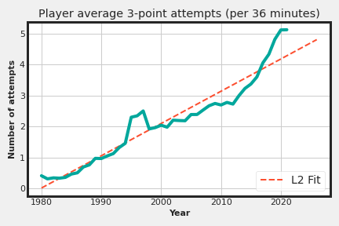

# BDA Miniproject 2022-23
🏀 Analysing the trend of 3-pointers in the NBA since its inception in the '80s
🏀 Stack: Apache Hadoop, Apache Spark, Python
🏀 Dataset: [Basketball Reference](https://www.basketball-reference.com/leagues/NBA_2021_totals.html)

👨‍💻 Developer
===============
Built with ❤︎ by Gandharv More