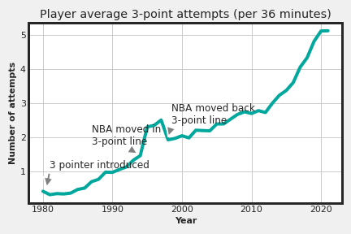

# BDA Miniproject 2022-23
🀠Analysing the trend of 3-pointers in the NBA since its inception in the '80s  
🀠Stack: Apache Hadoop, Apache Spark, Python  
🀠Dataset: [Basketball Reference](https://www.basketball-reference.com/leagues/NBA_2021_totals.html)  

👨‍💻 Developer
===============
Built with ❤︎ by Gandharv More